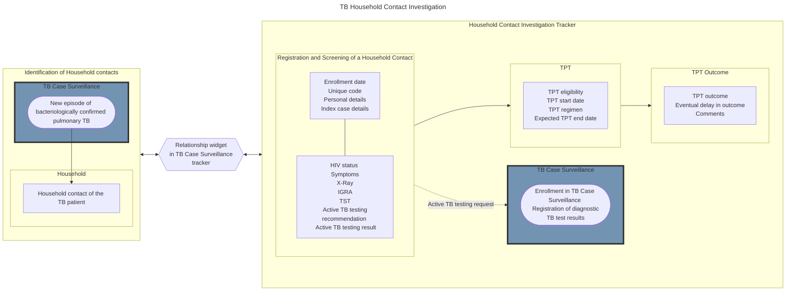

# TB Household Contact Investigation Design { #tb-hh-design }

## Workflow


## Reporting and Calculation of TPT Outcomes

All indicator data for the Household Contacts is aggregated quarterly. The period for the recording of the outcome is dependent on the length of the TPT regimen. In the current module, the longest recommended TPT regimen is 12 months. The period to report the outcomes for an active cohort is set up to 12 months after the end of the period during which the members of the active cohort are registered in the Household Contacts Investigation program. This period may be subject to change depending on country guidelines (eg. longest regimen available). 
The algorythm for reporting and calculating TPT outcomes in DHIS2 is described in the table below. 

 ```mermaid

%%{init: {'mirrorActors': false, 'theme': 'dark' } }%%
timeline
    title Reporting and Calculation of TPT Outcomes
    section Jan - Mar 2023 <br> 2023Q1
      Active cohort (Household contacts identified during 2023Q1 started on TPT): Included in report if outcome is available during this period
    section Apr - Jun 2023 <br> 2023Q2
      Members of active cohort with an outcome: Included in report if outcome is available during this period
    section Jul - Sep 2023 <br> 2023Q3
      Members of active cohort with an outcome: Included in report if outcome is available during this period
    section Oct - Dec 2023 <br> 2023Q4
      Members of active cohort with an outcome: Included in report if outcome is available during this period
    section Jan - Mar 2024 <br> 2024Q1
      Members of active cohort with an outcome: Included in report if outcome is available during this period: Outcomes for members of active cohort will be reported during this period
    section Apr 2024
      Final Outcomes Report for active cohort is available
```

